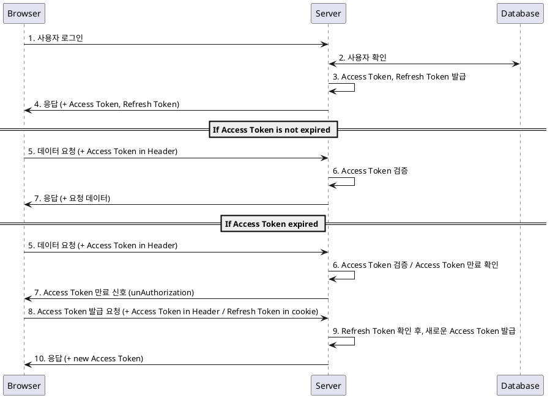
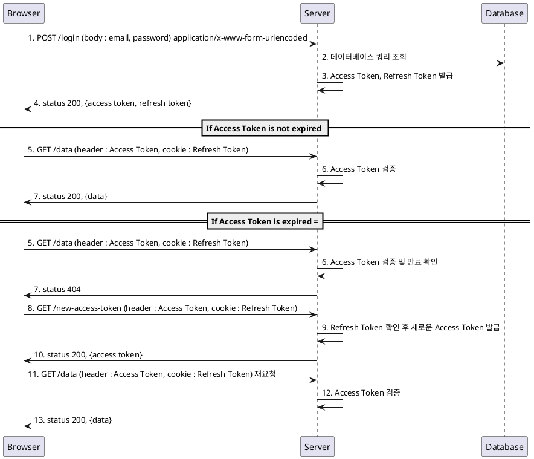

# JWT를 이용한 로그인 워크플로우

### 로그인 세부 내용
1. JWT를 이용한다.
    a. Access Token은 1시간, Refresh Token은 14일로 설정한다.
2. 기기별로 로그인은 하나만 가능하다.
    a. 만약, pc1에서 로그인한 상태에서 pc2를 로그인하면 pc1은 로그아웃된다.
3. 세션 로그인 정보는 서버 메모리에 저장한다.
    a. 관련하여 데이터베이스 or Redis 사용 여부는 이후 정한다.

### 사용자 워크플로우

### API
- Access Token은 Browser에서 State로 가지고 API 요청 시 Header로 요청한다.
- Refresh Token은 Cookie로 설정한다. 

